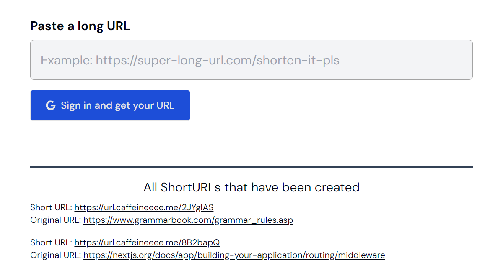

<div align="center">
<a target="_blank" rel="noopener noreferrer nofollow" href="https://url.caffeineeee.me">
    
</a>
</div>

# url-shortener

Shorten your URL!

This project is inspired by the following article: https://medium.com/@sandeep4.verma/system-design-scalable-url-shortener-service-like-tinyurl-106f30f23a82.

- Implements BASE62 conversion for getting a shortened URL.
- Implements NextJS middleware for redirection if a short URL maps to a long URL.

## Getting Started

First, run the development server:

```bash
git clone https://github.com/caffeineeee/url-shortener.git
```

```bash
cd url-shortener
```

```bash
pnpm i
```

```bash
pnpm dev
```

Open [http://localhost:3000](http://localhost:3000) with your browser to see the result.

## Database Schema

```sql
CREATE TABLE `urls` (
	`id` text(128) PRIMARY KEY NOT NULL,
	`long_url` text NOT NULL,
	`short_url` text NOT NULL,
	`created_by` text NOT NULL,
	`created_at` text DEFAULT CURRENT_TIMESTAMP NOT NULL,
	FOREIGN KEY (`created_by`) REFERENCES `users`(`email`) ON UPDATE no action ON DELETE cascade
);

CREATE TABLE `users` (
	`id` text(128) PRIMARY KEY NOT NULL,
	`email` text NOT NULL,
	`created_at` text DEFAULT CURRENT_TIMESTAMP NOT NULL
);

CREATE UNIQUE INDEX `urls_short_url_unique` ON `urls` (`short_url`);
CREATE UNIQUE INDEX `users_email_unique` ON `users` (`email`);
```